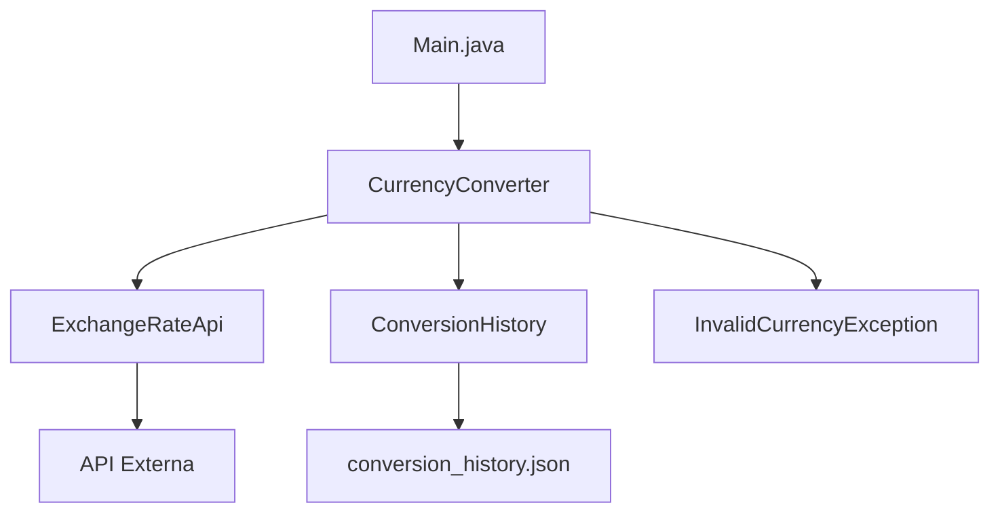

# 💱 Conversor de Moneda con API


<div align="center">
  
</div>

## 📝 Descripción
Un **conversor de monedas** moderno desarrollado en Java que utiliza la API de [ExchangeRate-API](https://www.exchangerate-api.com/) para conversiones en tiempo real entre las principales monedas de América Latina.

## ✨ Características principales
| Funcionalidad | Monedas | Estado |
|--------------|---------|--------|
| Conversión básica | USD ↔ ARS | ✅ |
| Conversión básica | USD ↔ BRL | ✅ |
| Conversión básica | USD ↔ COP | ✅ |
| Historial de conversiones | JSON | ✅ |
| Manejo de errores | Custom Exceptions | ✅ |

## 🏗 Estructura del proyecto



## Diagrama de Clases


## Detalles de Implementación
- **CurrencyConverter**: Esta clase contiene la lógica para realizar las conversiones entre monedas. Se conecta a la API ExchangeRate-API para obtener las tasas de cambio.
- **ExchangeRateApi**: Se encarga de la interacción con la API REST que proporciona las tasas de cambio entre monedas.
- **ConversionResult**: Es una clase de tipo record que guarda el resultado de la conversión, incluyendo las monedas involucradas, la tasa de cambio y el monto convertido.
- **ConversionHistory**: Permite guardar y cargar el historial de conversiones realizadas. Los resultados se almacenan en un archivo JSON para mantener un registro persistente.
- **InvalidCurrencyException**: Excepción personalizada que se lanza si se intenta realizar una conversión con una moneda no válida o si la API devuelve un error.

## Uso
- Al ejecutar la aplicación, el usuario verá un menú interactivo desde la consola para seleccionar la conversión que desea realizar.
- El usuario ingresa el monto a convertir, y el sistema devuelve el resultado de la conversión.
- El historial de conversiones se guarda en un archivo `conversion_history.json` para ser consultado en futuras ejecuciones.

## Requisitos
- Java 11 o superior.
- Internet para obtener las tasas de cambio desde la API.
- API Key para acceder a ExchangeRate-API (puedes obtenerla [aquí](https://www.exchangerate-api.com/)).

## Instalación
1. Clona este repositorio:
```bash
git clone https://github.com/Juan-Matias/Conversor_de_Monedas_APP.git
